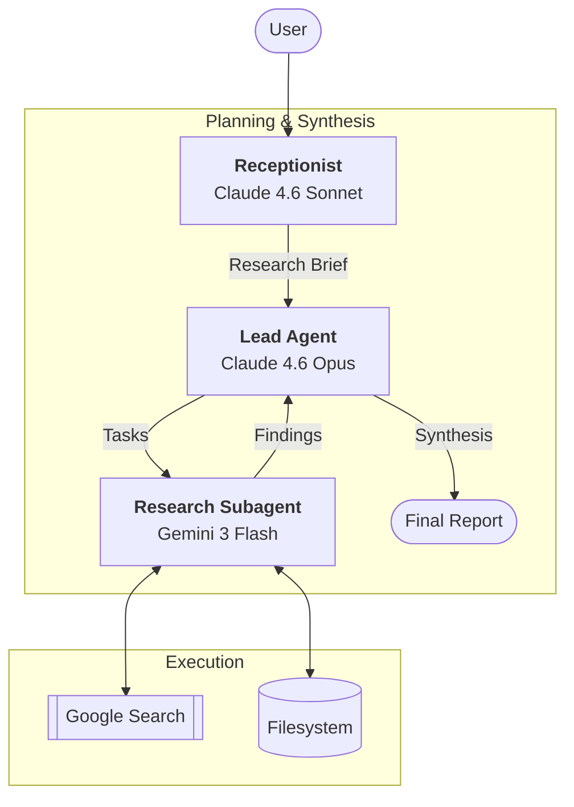

# Deep Research — Multi-Agent Research System

A modular, multi-agent research pipeline inspired by [Anthropic's multi-agent research system](https://www.anthropic.com/engineering/multi-agent-research-system). This system orchestrates specialized LLM agents to transform a vague research request into a comprehensive, sourced, and synthesized Markdown report.

## 🏛 Architecture

The system uses a hierarchical "Hub and Spoke" architecture with three distinct agent roles:



### Agent Roles

1.  **Receptionist (Claude 4.6 Sonnet):** Handles the interactive intake. It asks clarifying questions to narrow down the topic, scope, and depth until a structured research brief is produced.
2.  **Lead Agent (Claude 4.6 Opus):**
    - **Planning:** Decomposes the brief into specific, parallelizable research tasks.
    - **Synthesis:** Aggregates findings from all subagents, resolves contradictions, and writes the final `report.md`.
3.  **Research Subagent (Gemini 3 Flash):** Executes individual research tasks in parallel. Utilizes **Google Search grounding** to find up-to-date information and writes detailed findings to the workspace.

## 🚀 Features

- **Hybrid Backends:** Supports both **API** (SDK-based) and **CLI** (Subprocess-based) execution modes.
- **Parallel Execution:** Subagents run concurrently using `asyncio`, significantly reducing total research time.
- **Google Search Grounding:** Real-time web access via Gemini's native search tools.
- **Structured Workspace:** All intermediate plans and findings are preserved in a dedicated workspace directory.
- **Resilient Tool-Use:** Custom tool-use loops for Anthropic and Gemini with automatic retries and JSON fallback parsing.

## 🛠 Setup

### Prerequisites

- Python 3.11+
- [uv](https://github.com/astral-sh/uv) (recommended) or `pip`

### Environment Variables

Create a `.env` file (see `.env.example`):

```bash
ANTHROPIC_API_KEY=your_key_here
GOOGLE_API_KEY=your_key_here
```

### Installation

```bash
# Using uv
uv sync

# Using pip
pip install -e .
```

## 📖 Usage

### Command Line
Run the main research pipeline:

```bash
# Default API mode
python main.py

# CLI mode (uses local 'claude' and 'gemini' CLIs)
python main.py --backend cli

# Custom workspace
python main.py --workspace ./my-research-project
```

### Gradio Interface
A web-based GUI is available for interactive research:

```bash
# Using uv (recommended)
uv run app.py

# Using python
python app.py
```

### Workspace Structure

Each research session is organized into a unique subfolder within the workspace directory (e.g., `workspace/my-topic-20260424-123456/`):

- `.../plan.json`: The Lead's decomposition of the research brief.
- `.../findings/`: Individual `.md` files containing raw research from each subagent.
- `.../report.md`: The final synthesized research report.

## 📂 Examples

You can find sample research outputs in the `examples/` directory:

- **[Microsoft AI Transformation (2023-2026)](examples/microsoft_research/report.md):** A comprehensive report on Microsoft's financial evolution, AI product integration (Copilot, Azure), and strategic institutional positioning.
- **[US Actions on Iran-Israel Conflict (Apr-Nov 2024)](examples/us_actions_in_iran_israel_conf/report.md):** An analysis of US diplomatic and military responses to the Iran-Israel escalation and its correlation with global oil prices.

## 🧪 Development

### Running Tests

```bash
# Run all unit tests
uv run pytest

# Run manual integration tests
uv run python tests/manual/test_cli_pipeline.py
uv run python tests/manual/test_receptionist.py
```

### Linting & Formatting

```bash
uv run ruff check .
uv run ruff format .
```

## 📈 Project Status

This project is currently in **Phase 3 (Iterative Deepening)**.

- [x] Phase 1: API Backend (Stable)
- [x] Phase 2: CLI Backend (Stable)
- [ ] Phase 3: Advanced Research Features (Iterative Deepening, Dynamic Tooling)

Refer to [.ai/assets/progress.md](.ai/assets/progress.md) for detailed task tracking.

---

_Inspired by the Anthropic Research System. Built for modularity and local execution._
