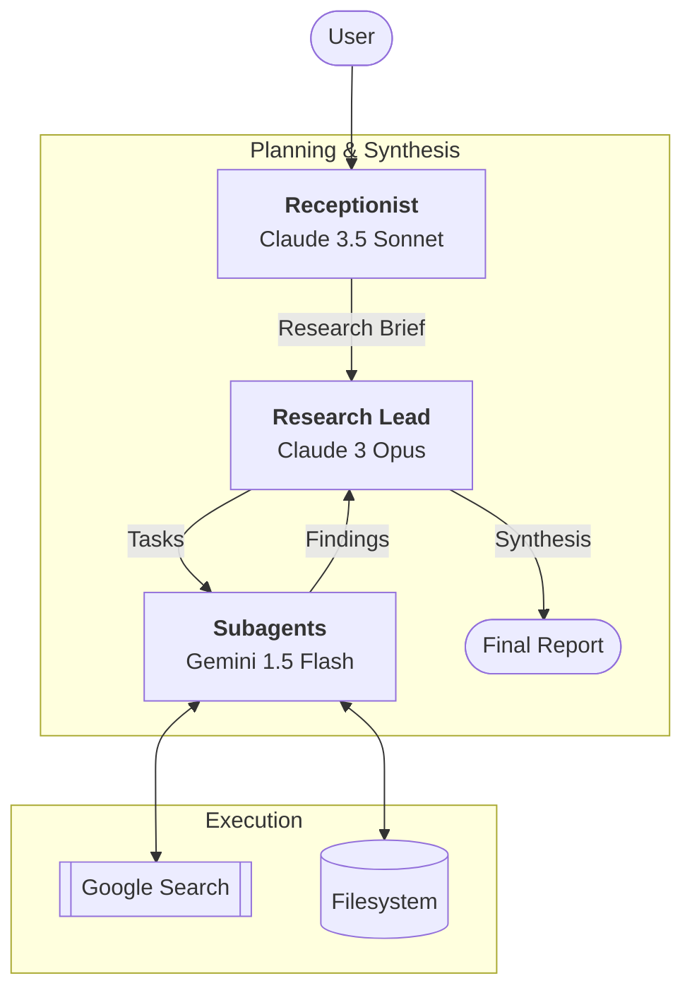

# Deep Research — Multi-Agent Research System

A modular, multi-agent research pipeline inspired by [Anthropic's multi-agent research system](https://www.anthropic.com/engineering/multi-agent-research-system). This system orchestrates specialized LLM agents to transform a vague research request into a comprehensive, sourced, and synthesized Markdown report.

## 🏛 Architecture

The system uses a hierarchical "Hub and Spoke" architecture with three distinct agent roles:



### Agent Roles
1.  **Receptionist (Claude 3.5 Sonnet):** Handles the interactive intake. It asks clarifying questions to narrow down the topic, scope, and depth until a structured research brief is produced.
2.  **Research Lead (Claude 3 Opus):** 
    *   **Planning:** Decomposes the brief into specific, parallelizable research tasks.
    *   **Synthesis:** Aggregates findings from all subagents, resolves contradictions, and writes the final `report.md`.
3.  **Subagents (Gemini 1.5 Flash):** Execute individual research tasks in parallel. They utilize **Google Search grounding** to find up-to-date information and write detailed findings to the workspace.

## 🚀 Features

- **Hybrid Backends:** Supports both **API** (SDK-based) and **CLI** (Subprocess-based) execution modes.
- **Parallel Execution:** Subagents run concurrently using `asyncio`, significantly reducing total research time.
- **Google Search Grounding:** Real-time web access via Gemini's native search tools.
- **Structured Workspace:** All intermediate plans and findings are preserved in a dedicated workspace directory.
- **Resilient Tool-Use:** Custom tool-use loops for Anthropic and Gemini with automatic retries and JSON fallback parsing.

## 🛠 Setup

### Prerequisites
- Python 3.11+
- [uv](https://github.com/astral-sh/uv) (recommended) or `pip`

### Environment Variables
Create a `.env` file (see `.env.example`):
```bash
ANTHROPIC_API_KEY=your_key_here
GOOGLE_API_KEY=your_key_here
```

### Installation
```bash
# Using uv
uv sync

# Using pip
pip install -e .
```

## 📖 Usage

Run the main research pipeline:

```bash
# Default API mode
python main.py

# CLI mode (uses local 'claude' and 'gemini' CLIs)
python main.py --backend cli

# Custom workspace
python main.py --workspace ./my-research-project
```

### Workspace Structure
- `workspace/plan.json`: The Lead's decomposition of the research brief.
- `workspace/findings/`: Individual `.md` files containing raw research from each subagent.
- `workspace/report.md`: The final synthesized research report.

## 🧪 Development

### Running Tests
```bash
# Run all unit tests
pytest

# Run manual integration tests
python tests/manual/test_gemini_loop.py
python tests/manual/test_anthropic_loop.py
```

### Linting & Formatting
```bash
ruff check .
ruff format .
```

## 📈 Project Status
This project is currently in **Phase 2 (CLI Backend Integration)**. 
- [x] Phase 1: API Backend (Stable)
- [x] Phase 2: CLI Backend (Wired & Testing)
- [ ] Phase 3: Advanced Research Features (Citations, Iterative Deepening)

Refer to [.ai/assets/progress.md](.ai/assets/progress.md) for detailed task tracking.

---
*Inspired by the Anthropic Research System. Built for modularity and local execution.*
